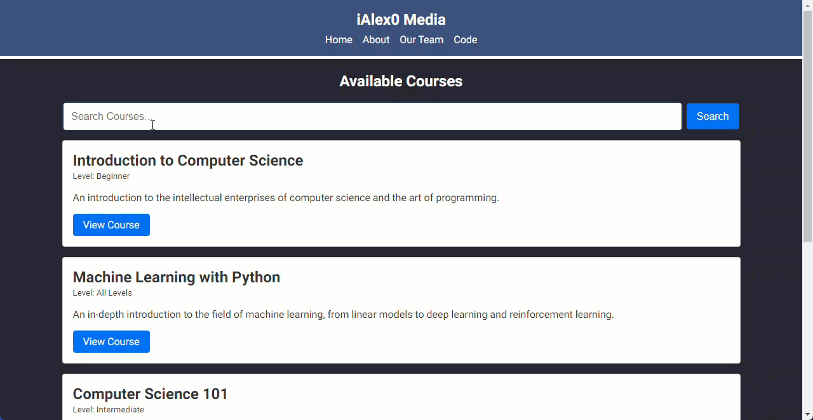
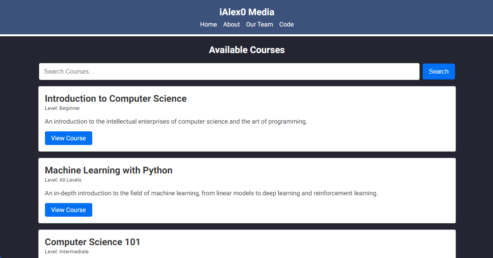
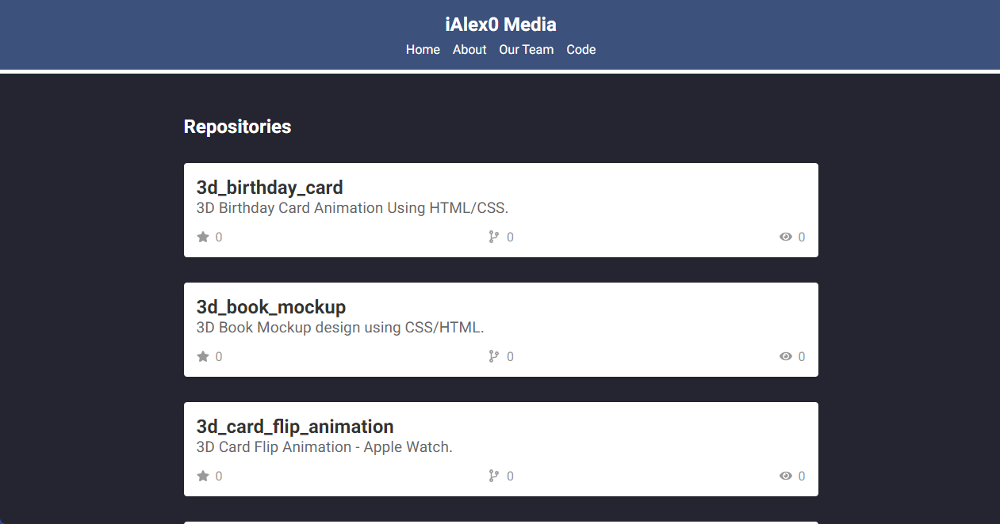

# Next.js 13 Demo

> This is a educational platform that allows users to search for available courses, view all public github repo's under the iAlex0 account. 

It uses the newer react features such as:

- App directory
- New routing system
- Next Fonts
- React Server Components
- Data Fetching
- Layouts
- Metadata API
- API Route Handlers
- loading.js Page
- and more

## Demo


## Screenshot - Courses


## Screenshot - Repo's



## Usage

Install dependencies:

```bash
npm install
# or
yarn
```

Run the development server:

```bash
npm run dev
# or
yarn dev
```

Open [http://localhost:3000](http://localhost:3000) with your browser to see the result.

Build the project:

```bash
npm run build
# or
yarn build
```

Run production build:

```bash
npm run start
# or
yarn start
```


## License
MIT © iAlex0